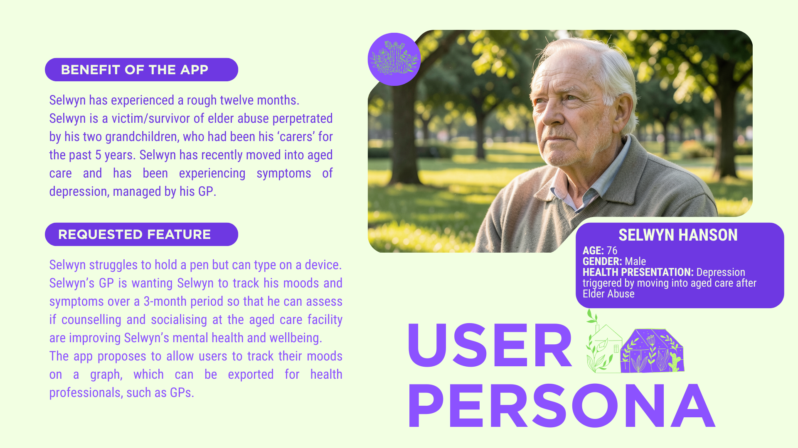

# Welcome to...

<picture>
  <source media="(prefers-color-scheme: dark)" srcset="./images/banner-dark.png">
  <source media="(prefers-color-scheme: light)" srcset="images/banner-light.png">
  
</picture>

## Navigation:

> * [Our Front-End Repository](https://github.com/The-Village-Wellness-App/village-frontend)
> * [Our Back-End Repository](https://github.com/The-Village-Wellness-App/village-backend)
> * [Documentation:]() [here,]() [here,]() [and here!]()
> * [Our Style Guide]()

## Context

This project was created as part of an academic Web Development assessment using MongoDB, Express.js, React and Node.js (MERN Stack). The Village Wellness App organisation is made up of a documentation repository, a backend application repository, and a frontend application respository.

Project work is seperated into two kanban project boards - one was used for [project planning](https://github.com/orgs/The-Village-Wellness-App/projects/2) in the initial stages of the project, and one for [build planning (currently private).](https://github.com/orgs/The-Village-Wellness-App/projects/1)

## Purpose of the App

## Intended Audience

